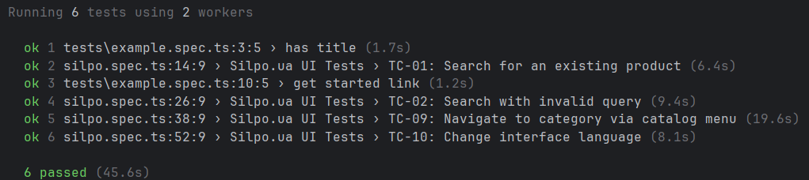

# Звіт з лабораторної роботи №2
[cite_start]**Тема:** Автоматизоване UI-тестування веб-застосунку[cite: 1]  
**Виконала:** Кірієнко Каріна  
**Об'єкти тестування:** silpo.ua (основний) та playwright.dev (для базової перевірки середовища)

## Мета роботи
[cite_start]Набуття практичних навичок автоматизації тестування користувацького інтерфейсу веб-застосунків та ознайомлення з принципами побудови автоматизованих тестів[cite: 1].

## Стек технологій
* **Мова програмування:** TypeScript / JavaScript (Node.js)
* **Фреймворк для тестування:** Playwright
* **Браузер:** Google Chrome (Headed mode для обходу антибот-систем)

## [cite_start]Опис реалізованих тестових сценаріїв[cite: 1]
Під час виконання роботи було налаштовано середовище та успішно виконано 6 автоматизованих тестів (2 базових та 4 кастомних для e-commerce проєкту):

**Базові перевірки середовища (tests/example.spec.ts):**
1. **has title:** Перевірка наявності коректного заголовка сторінки фреймворку.
2. **get started link:** Перевірка клікабельності та роботи базового посилання.

**Ключові користувацькі сценарії silpo.ua (tests/silpo.spec.ts):**
3. **TC-01: Search for an existing product**  
   *Опис:* Валідний пошук товару. Перевіряється введення тексту, натискання Enter та видимість елементів з цінами у результатах видачі.
4. **TC-02: Search with invalid query**  
   *Опис:* Невалідний пошук. Перевіряється реакція системи на випадковий набір символів та поява повідомлення про відсутність результатів.
5. **TC-09: Navigate to category via catalog menu**  
   *Опис:* Навігація по каталогу. Скрипт знаходить головне меню, переходить у відповідну категорію та перевіряє зміну URL-адреси.
6. **TC-10: Change interface language**  
   *Опис:* Перевірка локалізації. Скрипт знаходить перемикач мови, змінює її та перевіряє, чи оновилися ключові елементи інтерфейсу.

## [cite_start]Результати запуску тестів[cite: 1]
Всі 6 реалізованих тестів успішно пройшли перевірку.

## Інструкція із запуску
1. Встановіть залежності: `npm install`
2. Запустіть тести: `npx playwright test --headed`